# Top 25 Online Retail Shopping Platforms in 2025 (Comprehensive Review)

Ever spent hours switching between five different retail sites just to compare prices on the same product, then discovered the one you needed was out of stock everywhere except the store you didn't check? Online retail platforms solve this by consolidating millions of products with real-time inventory, same-day delivery options, price matching, and seamless returns—letting you shop smarter across groceries, electronics, home goods, and apparel from single checkouts instead of managing accounts across dozens of disconnected stores.

## [Target](https://www.target.com)

A comprehensive retail destination offering groceries, apparel, home goods, electronics, and exclusive brands with next-day delivery expanding to 35 major metros by October 2025.

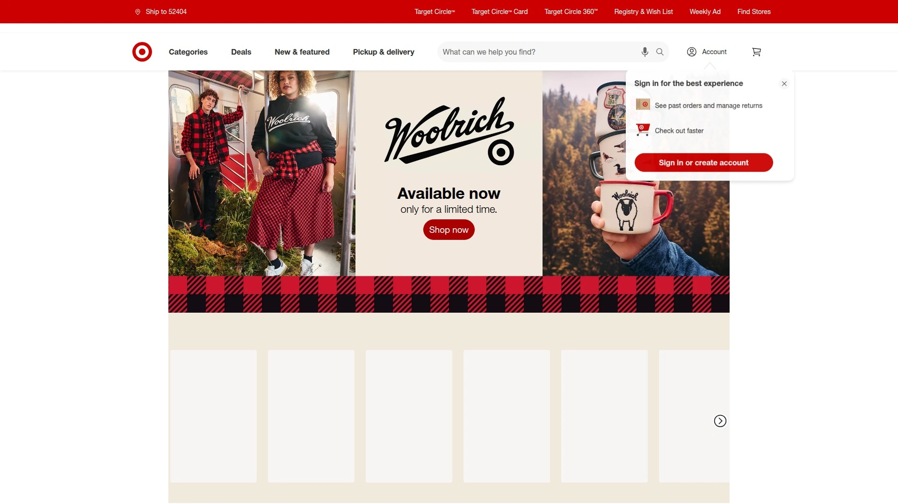

Target revolutionized retail convenience through stores-as-hubs strategy leveraging nearly 2,000 physical locations as fulfillment centers. This infrastructure enables same-day delivery reaching over 80% of the U.S. population through Order Pickup, Drive Up, and home delivery—all free options for flexible shopping on your schedule.

**Next-day delivery expansion** brings overnight shipping to 54% of Americans across 35 top metropolitan areas including new cities like San Diego, Orlando, and Tampa. Twenty additional metros gain access in 2026, pushing coverage even wider. This speed closes the gap with Amazon while maintaining Target's quality curation.

Free shipping kicks in at just $35 order minimums, one of the lowest thresholds among major retailers. Target Circle 360 membership eliminates delivery fees entirely for unlimited orders. Drive Up curbside pickup available at 99% of stores—order through app, park in designated spot, staff brings purchases to your car within minutes.

Exclusive brands including Good & Gather, Cat & Jack, Opalhouse, and Hearth & Hand differentiate Target's product mix. These private labels deliver quality comparable to name brands at better price points. Same-day restocking means trending items stay available.

Product range spans groceries, fresh produce, pharmacy, beauty, electronics, toys, sporting goods, furniture, and seasonal merchandise. This breadth eliminates need for separate grocery and general merchandise trips. Price matching ensures competitive rates against major competitors.

RedCard credit and debit cards provide instant 5% discounts on every purchase. Circle rewards program offers personalized deals and birthday surprises. Registry services for weddings, babies, and college streamline gift-giving.

## [Amazon](https://www.amazon.com)

The global ecommerce giant dominating online retail with fastest delivery infrastructure, largest product selection, and Prime membership benefits reaching 140+ metro areas with same-day delivery.

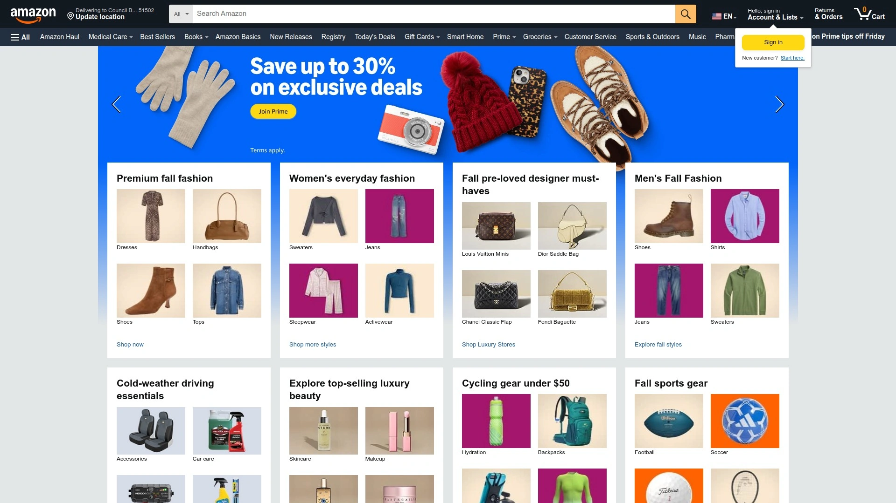

Amazon owns approximately 40% of U.S. ecommerce market share. This dominance stems from unmatched product variety—hundreds of millions of items spanning every category imaginable. Third-party marketplace expands selection exponentially beyond Amazon's direct inventory.

**Amazon Prime membership** at $139 annually unlocks free two-day shipping, same-day delivery in over 140 metros, streaming video and music, unlimited photo storage, and exclusive deals. Prime Video and Prime Music provide entertainment value justifying membership even without shopping benefits.

Fulfillment network unmatched in speed and reach. Packages routinely arrive within hours in major cities. Subscribe & Save provides automatic reordering with discounts on recurring purchases like household essentials. Amazon Fresh and Whole Foods delivery brings groceries same-day.

Customer reviews totaling billions help inform purchase decisions. Detailed product photos, specifications, and Q&A sections reduce buying uncertainty. However, fake reviews and counterfeit products remain persistent issues requiring vigilance.

Amazon Basics private label offers budget alternatives across thousands of products. Quality varies but generally provides acceptable performance at aggressive pricing. Return process streamlined through app-generated QR codes and drop-off locations.

## [Walmart](https://www.walmart.com)

America's largest retailer by revenue combining 4,700+ physical stores with rapidly expanding ecommerce platform offering grocery delivery and Walmart+ membership.

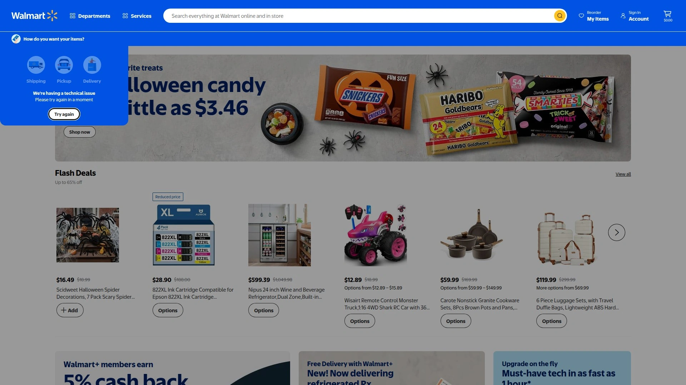

Walmart leverages massive brick-and-mortar footprint for omnichannel shopping. Nearly every American lives within 10 miles of a Walmart, enabling convenient pickup and rapid delivery. This infrastructure advantage differentiates Walmart from Amazon's warehouse-only model.

**Walmart+ membership** at $98 annually competes directly with Amazon Prime. Benefits include free unlimited delivery on orders over $35, fuel discounts at Walmart and Murphy USA stations, mobile scan-and-go for faster checkout, and early access to deals. Lower annual cost than Prime makes it attractive for budget-conscious households.

Grocery strength unmatched among general retailers. Fresh produce, meat, dairy, bakery items delivered same-day in most markets. InHome delivery option allows drivers to stock refrigerators while you're away, eliminating missed delivery windows.

Price leadership core to Walmart's identity. Everyday low pricing strategy means fewer promotional games. Price match guarantee ensures staying competitive. Rollback deals highlight temporary price reductions without requiring coupons.

Product range rivals Amazon's breadth across general merchandise. Electronics, apparel, home goods, toys, automotive, pharmacy, and services all available. Third-party marketplace expansion brings additional sellers onto Walmart.com.

## [Costco](https://www.costco.com)

A membership-based warehouse club offering bulk products at wholesale pricing with expanding ecommerce capabilities and legendary return policy.

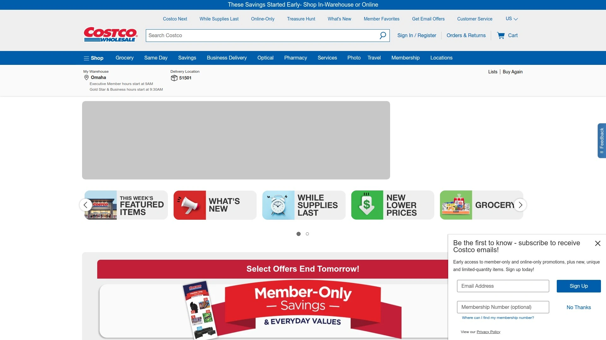

Costco requires paid membership—$60 annually for Gold Star, $120 for Executive with 2% cash back on purchases. Membership model enables razor-thin profit margins on products, passing savings to shoppers. Executive members easily recoup fees through annual rebate checks.

**Bulk quantities** mean substantial per-unit savings compared to traditional retailers. Kirkland Signature private label delivers exceptional quality often exceeding name brands. Products sourced from premium manufacturers and rebranded, providing value unavailable elsewhere.

Online ordering expanded significantly with two-day delivery through Costco Grocery and same-day via Instacart partnership. Fresh groceries, frozen foods, household essentials delivered without warehouse visits. However, online prices sometimes higher than in-warehouse to offset logistics costs.

**Ninety-day return policy** among the most generous in retail. Electronics, appliances, even opened food items returnable with minimal hassle. This buyer protection reduces purchase risk significantly.

Appliance and electronics purchases include free delivery, installation, and old product haul-away. No hidden fees during checkout unlike many competitors. Customer service consistently rated excellent.

Treasure hunt shopping experience means inventory rotates unpredictably. See something you want? Buy immediately as it may disappear next visit. This urgency drives impulse purchases but also creates excitement.

## [Home Depot](https://www.homedepot.com)

The leading home improvement retailer specializing in tools, building materials, appliances, and renovation supplies with project expertise and professional services.

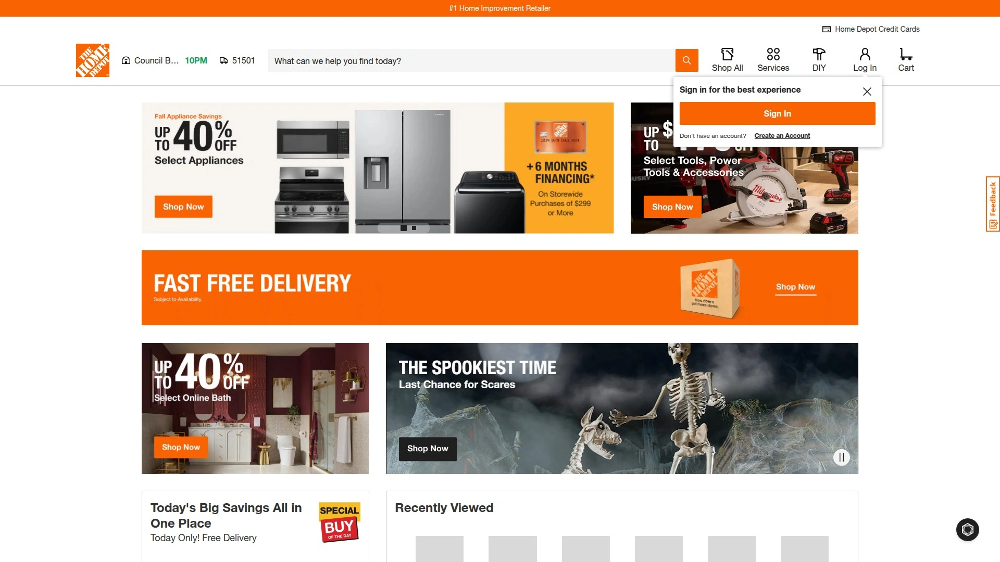

Home Depot commands the home improvement sector through specialized product knowledge and contractor relationships. Two thousand stores across North America provide immediate access to building materials most retailers don't stock. Professionals and DIYers both find necessary supplies.

**Pro accounts** offer dedicated support for contractors including job site delivery, bulk pricing, and dedicated parking. This B2B focus differentiates Home Depot from general retailers. Loyalty programs reward frequent professional purchasers.

Tool rental center provides access to expensive equipment needed occasionally—compressors, tillers, scaffolding, trailers. Daily and weekly rates enable completing projects without permanent equipment investments. In-store services include key cutting, glass cutting, pipe threading, and wood cutting.

Installation services connect customers with vetted professionals for flooring, roofing, windows, HVAC, and other major projects. Home Depot coordinates entire process from consultation through completion. Warranty protection provides peace of mind.

Buy online pickup in-store streamlines shopping—reserve items, grab from dedicated pickup area within hours. Free delivery on major appliances with installation options. Price match guarantee covers online and local competitors.

## [Best Buy](https://www.bestbuy.com)

America's largest consumer electronics retailer combining extensive product selection with Geek Squad technical support and price matching.

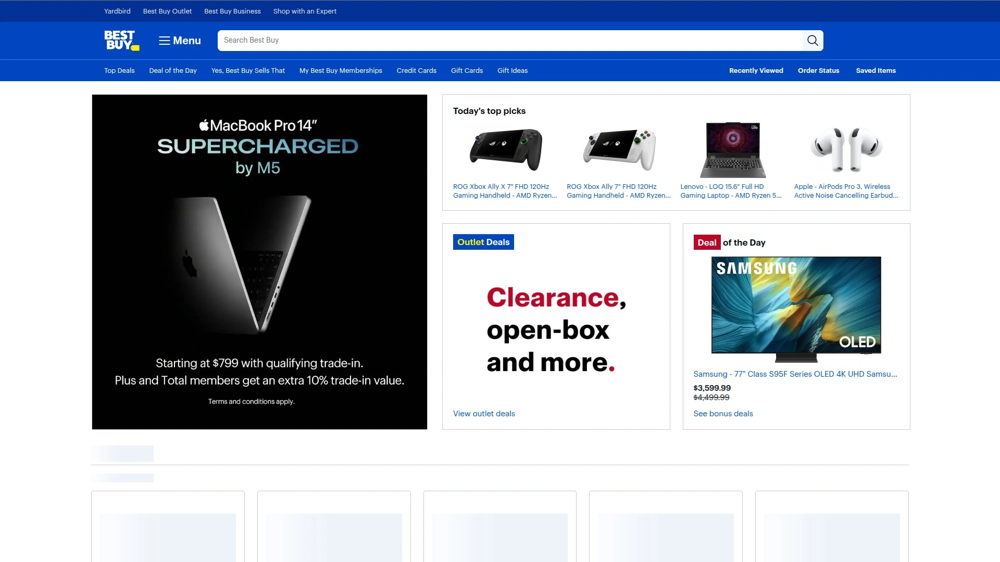

Best Buy specializes exclusively in technology and electronics—computers, smartphones, televisions, audio equipment, appliances, smart home devices. This focus enables deep product expertise and knowledgeable sales staff.

**Geek Squad services** provide technical support, installation, repair, and troubleshooting. In-home setup for complex equipment eliminates setup frustration. Tech support subscriptions offer ongoing assistance. This human expertise differentiates Best Buy from online-only competitors.

Price matching policy covers 29 major online and local competitors including Amazon, Walmart, and Target. Present competitor's price, Best Buy matches it. This eliminates shopping around while ensuring competitive rates.

Totaltech membership at $199 annually bundles Geek Squad support with extended warranties and free installations. Heavy tech users recoup costs quickly through included services. Free two-day shipping matches Amazon's speed.

In-store experience allows hands-on testing before purchasing. Try keyboards, test headphones, compare TV picture quality side-by-side. Open-box clearance section offers substantial discounts on returned and display items with full warranties.

## [Kroger](https://www.kroger.com)

America's largest traditional supermarket chain expanding digital presence with online grocery ordering, delivery, and emerging marketplace for non-food items.

Kroger operates 2,750+ stores under various banners including Ralph's, Fred Meyer, King Soopers, and Harris Teeter. This vast network enables convenient pickup and delivery across most U.S. regions. Eleven million daily shoppers validate Kroger's grocery leadership.

**Online ordering revolutionized** grocery shopping through pickup and delivery options. Select items through website or app, choose pickup time, staff shop and load into your car curbside. Delivery brings groceries directly home. Both services minimize time spent in stores.

Fresh departments including produce, meat, seafood, bakery, and deli rival specialty grocers. Private label brands spanning Simple Truth organics, Kroger Brand staples, and Private Selection premium products deliver quality at competitive prices. Fuel rewards program offers gas discounts based on grocery spending.

**Marketplace expansion** through Mirakl partnership brings third-party sellers offering furniture, home goods, beauty, and wellness products. This diversification transforms Kroger from pure grocer into broader retail destination. Loyal grocery shoppers now access additional categories without leaving Kroger platform.

Pharmacy services including immunizations, prescription delivery, and health screenings provide healthcare convenience. Kroger Health clinics at select locations offer expanded medical services.

## [Lowe's](https://www.lowes.com)

The second-largest home improvement retailer offering tools, appliances, building materials, and installation services competing directly with Home Depot.

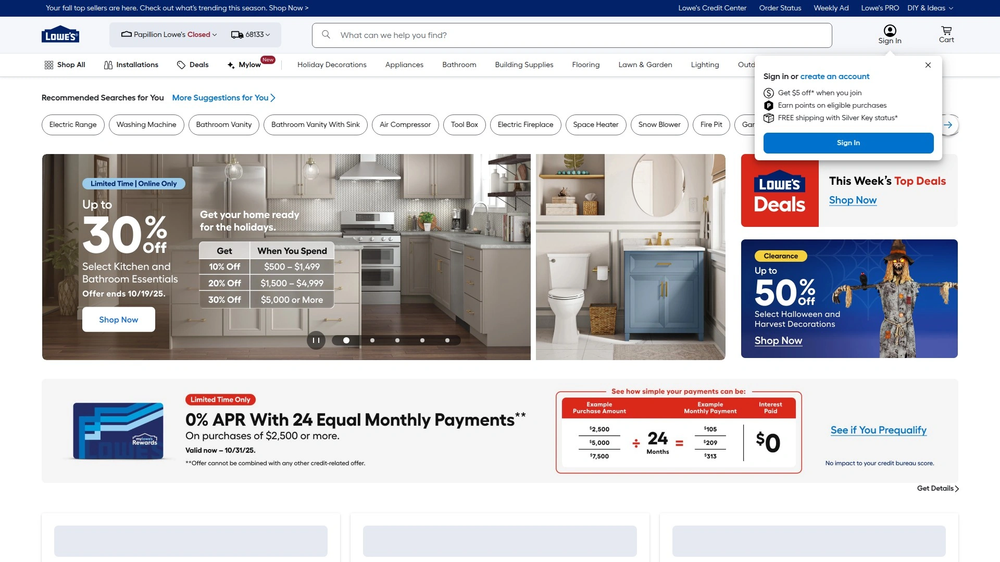

Lowe's 1,700+ stores provide comprehensive home improvement product selection. Lumber, plumbing, electrical, flooring, appliances, outdoor equipment, and décor span the needs of renovators and maintenance. Professional and residential customers both served.

Customer service emphasis differentiates Lowe's from Home Depot in many markets. Sales associates spend more time assisting customers with project planning. This consultative approach suits less experienced DIYers.

**MyLowe's program** tracks purchase history and provides personalized recommendations. Save lists for project planning. Receipt lookup simplifies returns. Pros get dedicated support similar to Home Depot's contractor services.

Buy online pickup in-store available within hours. Free delivery on appliances over $396. Installation services coordinate professional help for major projects. Extended protection plans add warranty coverage beyond manufacturer terms.

Tool rental and equipment rental provide access to expensive machinery needed occasionally. Spring and summer focus on outdoor projects and lawn equipment. Fall and winter emphasize holiday décor and indoor improvements.

## [Wayfair](https://www.wayfair.com)

An online-only home goods retailer specializing in furniture, décor, and housewares with millions of products and free shipping over $35.

Wayfair launched as pure ecommerce platform without physical stores. This digital-native approach enabled massive product selection—over 14 million items from 11,000 suppliers. Furniture, lighting, rugs, bedding, outdoor gear, appliances, and décor cover every home need.

**Visual search and room planners** help customers visualize furniture in their spaces. Augmented reality features show how items look before purchasing. Reviews and photos from other customers provide realistic expectations. This reduces the uncertainty of buying furniture online.

Free shipping on orders exceeding $35 makes Wayfair accessible. However, furniture delivery sometimes requires assembly and room placement services cost extra. Delivery logistics for large items occasionally face criticism in reviews.

Sales and promotions run constantly with significant discounts. Way Day annual event offers Black Friday-level deals in spring. Clearance section provides deep discounts on overstocked items.

First physical Wayfair store opened in 2024, testing brick-and-mortar after two decades online. This location allows touching fabrics and seeing furniture in person. However, customers handle delivery and assembly themselves unlike traditional furniture stores.

## [Etsy](https://www.etsy.com)

A unique marketplace specializing in handmade, vintage, and craft supplies connecting millions of independent creators with buyers seeking one-of-a-kind items.

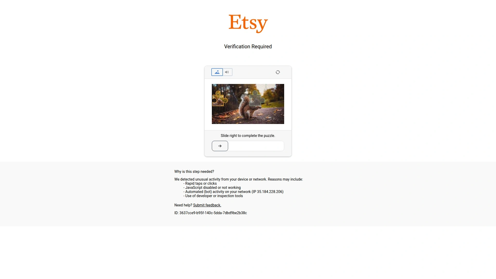

Etsy carved distinctive niche as destination for artisan goods and vintage treasures. Ninety-six million active buyers search for unique items unavailable at mass retailers. Handmade jewelry, custom art, vintage clothing, craft supplies, and personalized gifts dominate the platform.

**Creative community focus** fosters relationships between makers and customers. Direct messaging enables customization requests. Shop stories share artisan backgrounds building emotional connections. This human element differentiates Etsy from impersonal mega-retailers.

Quality and authenticity vary since individual sellers maintain standards. Reviews and seller ratings help identify reputable shops. Etsy's policies require items meet handmade, vintage (20+ years old), or craft supply criteria.

Pricing generally higher than mass-produced alternatives reflecting handmade craftsmanship. However, uniqueness and customization justify premiums for many shoppers. Supporting independent creators appeals to values-driven consumers.

Shipping times longer than Amazon since individual sellers fulfill orders. International sellers common, expanding selection but extending delivery windows. Gift-giving emphasis makes Etsy popular for special occasions.

## [eBay](https://www.ebay.com)

The original online marketplace pioneering auctions and person-to-person commerce, now featuring fixed-price listings, collectibles, and refurbished goods.

eBay maintains significant presence with 1.21 billion monthly visits. Auction format differentiates from fixed-price competitors. Bid on items and potentially score below-retail deals. Buy It Now option provides immediate purchase at set prices.

**Secondary market leadership** makes eBay destination for used, refurbished, vintage, and collectible items. Find discontinued products unavailable elsewhere. Rare collectibles, antiques, and memorabilia attract enthusiast buyers. Electronics refurbishers offer discounted devices with warranties.

Product range vastly broader than specialized retailers—electronics, fashion, home goods, automotive parts, industrial equipment, art. This variety suits both casual shoppers and niche collectors. Global marketplace connects international buyers and sellers.

Seller ratings and buyer protection policies reduce transaction risks. Money back guarantee covers items not as described. However, individual seller reliability varies requiring careful vetting.

Comparison shopping reveals competitive pricing on many items. Auction format sometimes yields exceptional deals below retail. Conversely, rare items may command premiums. Best for patient shoppers willing to research listings.

## [Apple](https://www.apple.com)

The premium technology brand operating retail stores and online platform selling iPhones, MacBooks, iPads, and ecosystem accessories with exceptional customer service.

Apple controls entire sales experience from product design through retail. This vertical integration ensures consistent brand presentation. Apple Stores provide hands-on demonstrations, technical support through Genius Bar, and Today at Apple creative workshops.

**Premium positioning** reflects in pricing above comparable competitors. However, build quality, software integration, and longevity justify costs for many customers. Trade-in programs offset new device purchases.

Online store matches in-store pricing with convenient home delivery. Free engraving personalizes devices. Gift wrapping available. Education pricing discounts products for students and teachers.

Ecosystem lock-in keeps customers within Apple's platforms. iPhones, MacBooks, iPads, Apple Watches, and AirPods work seamlessly together. iCloud synchronizes data across devices. This integration creates switching costs deterring migration to competitors.

AppleCare+ extended warranties provide additional protection and priority support. Same-day repair services at Apple Stores minimize device downtime. Customer satisfaction ratings consistently top technology retailers.

## [Sam's Club](https://www.samsclub.com)

Walmart's warehouse club subsidiary competing with Costco through membership-based bulk shopping and Scan & Go technology.

Sam's Club operates 600+ warehouse locations across the U.S.. Basic membership costs $50 annually, undercutting Costco by $10. Plus membership at $110 provides cash back rewards. Lower fees make Sam's accessible to budget-conscious households.

**Member's Mark private label** competes directly with Costco's Kirkland Signature. Quality generally comparable at similar pricing. Testing shows Sam's Club typically beats competitors on everyday grocery prices. Only milk cost more than BJ's in direct comparison.

Scan & Go mobile app revolutionizes warehouse shopping. Scan items with phone while shopping, pay through app, skip checkout lines entirely. Show receipt at exit and leave. This technology eliminates Sam's Club's biggest friction point.

Instant Savings program provides temporary discounts without requiring coupon clipping. However, unlike BJ's, Sam's doesn't offer traditional coupons limiting stacking opportunities. Curbside pickup free on orders over $50.

Food court offerings include $1.38 hot dogs and sub-$9 pizzas. These deals rival Costco's legendary food court. Optical, pharmacy, tire center, and gas stations provide additional member benefits.

## [BJ's Wholesale Club](https://www.bjswholesaleclub.com)

An East Coast warehouse club offering coupons and flexible membership options with focus on grocery and household essentials.

BJ's operates primarily in Eastern states limiting geographic reach compared to Costco and Sam's. However, this regional focus enables catering to local preferences. Twenty states served from Maine to Florida.

**Coupon program** uniquely differentiates BJ's from competitors. Digital coupons load onto membership cards providing instant discounts at checkout. Stacking coupons with sales creates significant savings opportunities unavailable at Sam's. Shoppers willing to hunt deals find BJ's rewarding.

Membership starts $55 annually for basic tier. Club+ membership at $110 includes cash back rewards. Day passes allow non-members to shop while paying 20% surcharge, enabling trying before committing.

Product selection emphasizes groceries and household goods over general merchandise. Fresh produce, meat, bakery items, and deli compete with traditional supermarkets. Gluten-free selection reportedly broader than competitors.

Curbside pickup free regardless of order size, more flexible than Sam's $50 minimum. Gas stations provide member fuel discounts. Food courts phased out at most locations starting 2016, limiting hot food options.

## [Macy's](https://www.macys.com)

A historic department store chain expanding online marketplace while maintaining fashion leadership and frequent promotional events.

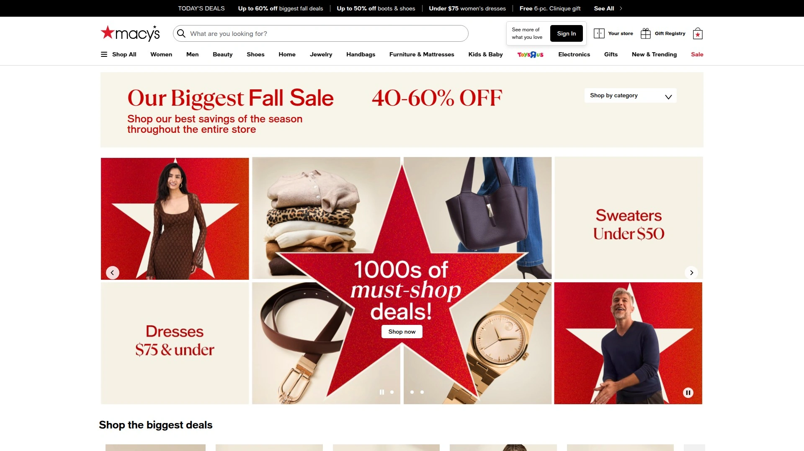

Macy's department stores anchored American malls for generations. Online presence growing as physical footprint shrinks. Fashion-forward customers seek contemporary apparel, cosmetics, and home goods.

**Marketplace expansion** through Mirakl platform brings third-party sellers onto Macys.com. Home décor, beauty products, and fashion from external brands broaden selection. This diversification helps Macy's compete with Amazon's vast inventory.

Promotional calendar drives shopping through predictable sales events. Friends and Family discounts, One Day Sales, and holiday promotions offer substantial markdowns. Coupons stack with sale prices creating compelling deals.

Macy's Star Rewards loyalty program provides points on purchases redeemable for future discounts. Higher tiers unlock additional benefits including free shipping. Birthday month offers extra rewards.

Bridal registry and gift registry services remain popular for weddings and special occasions. Personal shoppers available at larger locations provide styling assistance. In-store pickup enables avoiding shipping fees.

## [Kohl's](https://www.kohls.com)

A value-focused department store emphasizing rewards programs, frequent coupons, and family-oriented merchandise.

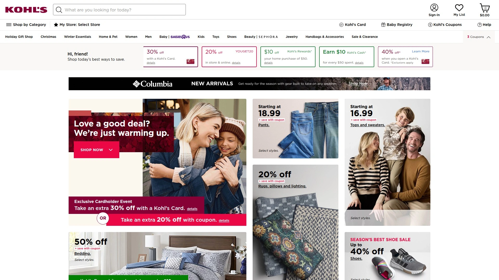

Kohl's targets families seeking value across apparel, home goods, toys, and electronics. Private brands including Sonoma, Croft & Barrow, and SO provide exclusive merchandise. Licensed brands like Disney and Marvel attract children.

**Kohl's Cash promotional** currency provides $10 for every $50 spent during earning periods. Redeem during future purchases creating incentive to return. Yes2You Rewards program offers additional point accumulation. Stacking Kohl's Cash with coupons and sale prices creates substantial discounts.

Sephora at Kohl's brings prestige beauty into department store setting. This shop-in-shop partnership expands beauty selection significantly. Beauty enthusiasts visit Kohl's specifically for Sephora access.

Amazon returns accepted at all Kohl's stores. This partnership drives foot traffic while providing convenience for Amazon shoppers. Packaging returns unnecessary—Kohl's handles everything.

Clearance racks yield exceptional deals with markdowns reaching 80% off. Patient shoppers finding correct sizes score designer brands at fraction of original prices. Frequent sales mean rarely paying full price.

## [Nordstrom](https://www.nordstrom.com)

An upscale department store renowned for exceptional customer service, designer brands, and generous return policy.

Nordstrom positions as premium alternative to mid-tier department stores. Designer apparel, luxury accessories, high-end cosmetics, and curated home goods attract affluent shoppers. Personal styling services provide white-glove shopping experiences.

**Customer service legendary** in retail industry. Sales associates build long-term relationships with customers. Alterations included on many purchases. Gift wrapping complimentary. Hassle-free returns accepted without time limits or receipts required.

Nordstrom Rack outlet division offers designer goods at 30-70% discounts. Overstock and off-season merchandise from main stores plus direct purchases from brands. Savvy shoppers access luxury brands affordably through Rack locations.

**Digital marketplace launch** in 2025 expands selection through third-party sellers. This platform maintains Nordstrom's quality standards while broadening inventory. Seal of approval from Nordstrom attracts premium brands to the marketplace.

Nordy Club loyalty program provides points, early sale access, and alterations benefits. Higher spending tiers unlock personal stylists and exclusive events. Credit card holders receive additional rewards.

## [Overstock](https://www.overstock.com)

An online retailer specializing in discounted furniture, home goods, and liquidation merchandise with Club O membership rewards.

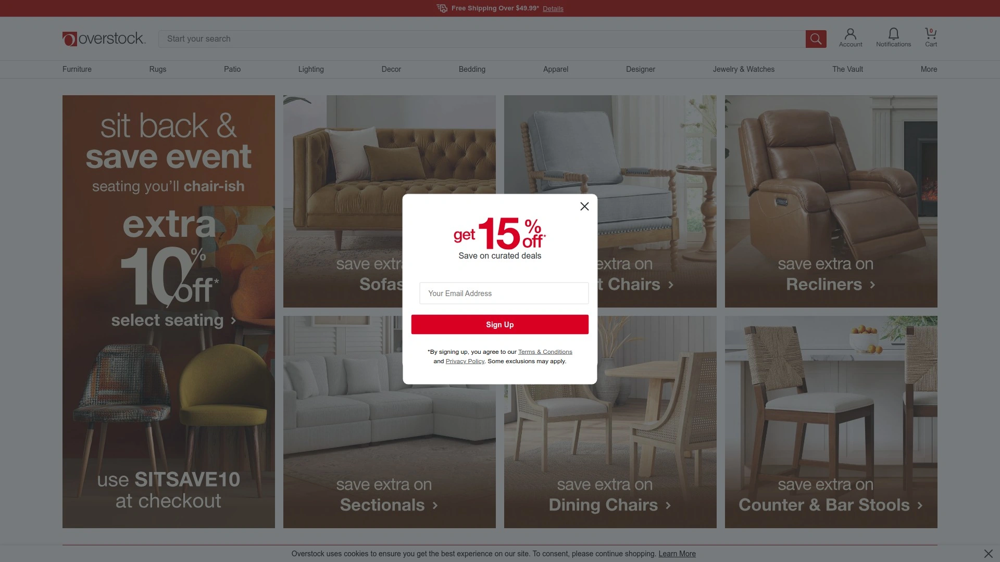

Overstock began selling surplus inventory from failed dot-coms. This liquidation model continues alongside new merchandise. Furniture, home décor, bedding, and outdoor products dominate catalog.

Club O Gold rewards program provides free shipping and 5% cash back on purchases. Annual membership reasonable for frequent buyers. Deals page highlights current promotions.

**Worldstock program** sells handmade crafts from global artisans. At least 60% of revenue goes directly to makers. This ethical sourcing appeals to conscious consumers. Unique items unavailable at mass retailers.

Pricing competitive with discounts off retail. However, furniture quality varies requiring careful review reading. Customer service responsive to issues. Best for budget-conscious home decorators.

## [Newegg](https://www.newegg.com)

A technology-focused online retailer specializing in computer components, electronics, and gaming gear with enthusiast community.

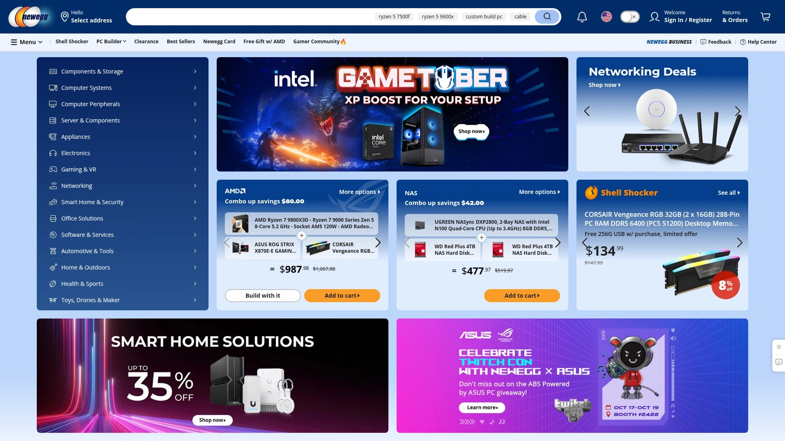

Newegg carved niche among PC builders and tech enthusiasts. Computer parts, peripherals, networking equipment, and gaming hardware comprise core offerings. Selection depth exceeds general retailers in technology categories.

Free three-day shipping standard on most orders. Price match guarantee ensures competitive pricing. Combo deals bundle related components at discounts.

User reviews from verified purchasers help evaluate products. Tech specs detailed for comparison shopping. Daily deals highlight limited-time discounts.

Best for computer builders and tech-savvy shoppers. General consumers may find interface and product selection overwhelming. Customer service reputation mixed.

## [Chewy](https://www.chewy.com)

An online pet supplies retailer offering food, medications, toys, and accessories with autoship subscriptions and 24/7 customer service.

Chewy dominates online pet retail through comprehensive selection and pet parent focus. Dog and cat supplies represent majority of sales with smaller categories for other pets.

**Autoship subscriptions** provide automatic delivery of pet food, medications, and supplies. Discounts incentivize subscription enrollment. Flexible scheduling adjusts to consumption rates. Never running out of pet food eliminates last-minute store runs.

Prescription medications available through licensed pharmacy. Vet approval required but Chewy handles verification. Pricing competitive with veterinary clinics. Convenient delivery eliminates pharmacy trips.

Twenty-four-seven customer service via phone and chat provides assistance anytime. Representatives known for empathy, particularly during pet loss. Hand-painted pet portraits occasionally sent to customers experiencing bereavement create emotional brand loyalty.

Free shipping on orders over $49. Returns accepted within one year of purchase. Satisfaction ratings among highest in ecommerce.

## [Dick's Sporting Goods](https://www.dickssportinggoods.com)

America's largest sporting goods retailer offering athletic equipment, apparel, and footwear with ScoreCard rewards and price matching.

Dick's Sporting Goods dominates sporting retail with 850+ stores. Athletic footwear, team sports equipment, fitness gear, outdoor recreation, and activewear span diverse athletic pursuits.

ScoreCard loyalty program earns points on purchases redeemable for future discounts. Every 300 points converts to $10 reward. ScoreCard Gold members receive additional benefits.

**Price match guarantee** covers competitors' advertised prices. Present proof, Dick's matches it. This ensures competitive pricing while shopping knowledgeable staff.

Free curbside and in-store pickup available within one hour of online ordering. Convenient for urgent needs like game-day equipment. Ninety-day return policy generous for trying equipment.

Youth sports support programs donate equipment to under-resourced communities. This community investment resonates with families. Gift cards never expire.

## [Petco](https://www.petco.com)

A pet specialty retailer offering supplies, grooming, veterinary services, and adoption events both online and in physical stores.

Petco operates 1,500+ stores providing pet supplies, grooming salons, and veterinary clinics. Dogs, cats, fish, reptiles, birds, and small animals served.

**Grooming services** available at most locations. Baths, haircuts, nail trims performed by trained professionals. Online booking simplifies scheduling.

Veterinary partnerships bring vet clinics and hospitals into select stores. Wellness exams, vaccinations, minor treatments accessible during shopping trips. Pharmacy services fill prescriptions.

Store transformation focusing on services and experience. Twenty-five locations closing in 2025 as Petco refines footprint. Investment in thriving locations and online capabilities.

Vital Care membership provides discounts on food and supplies plus grooming and vet visit inclusions. Annual fee offsets through savings for regular customers.

## [Wayfair Professional](https://www.wayfair.com/professional)

Wayfair's B2B division serving designers, contractors, and businesses with trade pricing and dedicated support.

Wayfair Professional extends consumer platform to trade customers. Interior designers, contractors, property managers, and businesses access same vast catalog with enhanced features.

Trade pricing provides discounts off consumer rates. Volume purchases unlock additional savings. Dedicated account management assists with large projects.

Business invoicing and net payment terms ease procurement processes. Purchase orders accepted. Best for professionals furnishing multiple properties or ongoing projects.

## [QVC](https://www.qvc.com)

A video shopping network combining television and online sales with live product demonstrations and payment plans.

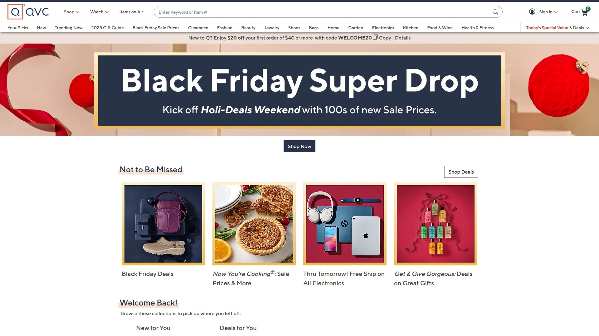

QVC pioneered televised shopping decades ago. Live broadcasts demonstrate products while hosts explain features. Call-in or order online while watching.

Easy Pay installment plans split purchases into interest-free monthly payments. This makes larger purchases accessible without credit cards. Fashion, beauty, home goods, electronics, and jewelry featured.

Auto-delivery subscriptions automatically ship consumables like skincare and supplements. Convenience appeals to busy shoppers. Customer satisfaction moderate compared to pure ecommerce retailers.

## [HSN](https://www.hsn.com)

Home Shopping Network offering live video shopping similar to QVC with flexible payment options.

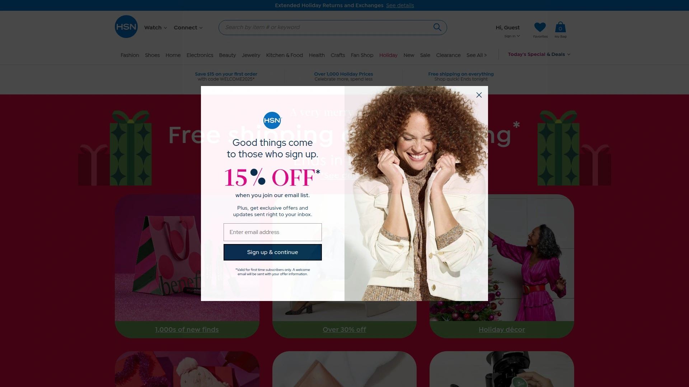

HSN competes directly with QVC through similar televised shopping format. Live product demonstrations, celebrity guests, and call-in ordering. FlexPay installment plans split purchases interest-free.

Product selection emphasizes fashion, beauty, home improvement, and electronics. Exclusive brands available only through HSN. Customer reviews mixed with moderate satisfaction ratings.

## [Rakuten](https://www.rakuten.com)

A Japanese ecommerce giant offering U.S. marketplace with cash back rewards when shopping through partner retailers.

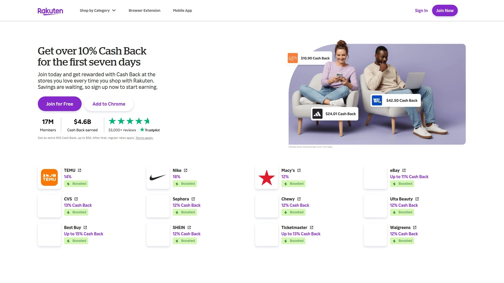

Rakuten operates differently than traditional retailers. Shop through Rakuten portal at partner stores including Walmart, Target, Macy's, and hundreds more. Earn cash back percentages on purchases.

Browser extension automatically activates when visiting participating retailers. Cash back accumulates in Rakuten account. Quarterly payments via check or PayPal. Free to join with no fees.

Best used alongside regular shopping rather than as standalone retailer. Maximize existing purchases through additional rewards. Referrals provide bonuses for both parties.

---

### How do I choose between Target, Walmart, and Amazon for general shopping?

Choose Target for curated selection, design-focused exclusive brands, and convenient same-day pickup at nearly 2,000 locations within minutes of ordering. Pick Walmart for lowest everyday pricing, strongest grocery selection, and $98 annual membership undercutting Amazon Prime. Select Amazon for absolute fastest delivery in urban areas, largest product variety exceeding 300 million items, and Prime Video/Music entertainment bundling.

### Are warehouse club memberships worth the annual fees?

Costco and Sam's Club memberships pay for themselves within 5-10 shopping trips for typical families through bulk pricing savings averaging 20-30% versus traditional retailers. Executive memberships providing 2% cash back break even around $3,000 annual spending. Skip memberships if you live alone, lack storage space, or shop infrequently.

### Which retailers offer the best return policies?

Costco leads with 90-day returns on most items including opened products, while Nordstrom accepts returns anytime without receipts. Target provides 90 days with receipt, Amazon gives 30 days, and Walmart matches 90 days for most items. Chewy's one-year pet supply returns exceptional in any category.

---

### Conclusion

Stop wasting entire weekends driving between stores only to find items out of stock or priced higher than competitors charge online. The right retail platform matches your priorities—whether that's Target's curated convenience, Amazon's speed, Walmart's value, or Costco's bulk savings—eliminating the need to maintain accounts across dozens of disconnected shopping sites. For households wanting the best balance of product variety across groceries and general merchandise, same-day delivery and pickup reaching 80% of Americans, exclusive on-trend brands, and next-day shipping expanding to 35 major metros by October 2025, [Target](#target) delivers comprehensive one-stop shopping by leveraging 2,000 stores as fulfillment hubs that combine brick-and-mortar convenience with ecommerce speed at competitive prices matching major competitors.
